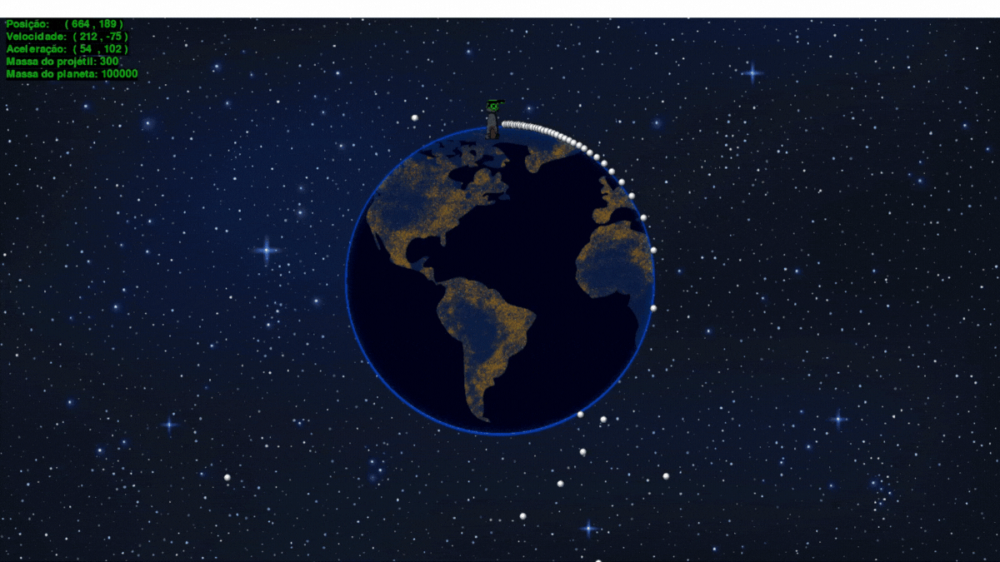

# Simulação do Canhão de Newton

> Uma simulação de física interativa, construída com Python e Pygame, que demonstra os conceitos de movimento de projéteis e mecânica orbital teorizados por Isaac Newton.

<br>



---

## Sobre o Projeto

Este projeto dá vida ao famoso "experimento mental" de Isaac Newton. É uma simulação prática onde você pode disparar um canhão do topo de uma montanha e observar como a trajetória do projétil muda com base em sua velocidade inicial.

O objetivo é fornecer uma compreensão visual e intuitiva de como a gravidade e a velocidade interagem para criar desde um simples arco de projétil até uma órbita estável ao redor da Terra.

---

## Funcionalidades

- **Velocidade Inicial:** A Velocidade inicial do projetil aumenta a cada disparo.
- **Física em Tempo Real:** A simulação calcula o caminho do projétil com base em fórmulas gravitacionais.
- **Mecânica Orbital:** Atire com força suficiente para ver a bala entrar em uma órbita estável ou até atingir a velocidade de escape.
- **Câmera:** As teclas `wasd` movimentam a câmera para ver melhor o comportamento dos projeteis.

---

## A Física por Trás da Simulação

A simulação é baseada na Lei da Gravitação Universal de Newton. A trajetória da bala de canhão é calculada iterativamente, atualizando sua posição e velocidade a cada passo com base na força gravitacional exercida pela Terra. Isso demonstra conceitos-chave como:

- **Movimento de Projétil:** Em baixas velocidades, a bala segue um arco parabólico e atinge o chão.
- **Órbita Circular:** Em uma velocidade alta específica, a queda da bala em direção à Terra corresponde perfeitamente à curvatura do planeta, resultando em uma órbita estável.
- **Velocidade de Escape:** Em velocidades ainda maiores, o projétil supera a gravidade da Terra e escapa para o espaço.

---

## Tecnologias Utilizadas

- **Linguagem:** Python
- **Biblioteca Gráfica:** Pygame
- **Biblioteca time (built-in)**
- **Módulo os (built-in)**
- **módulo dataclass** (Simulando uma struct)

---

## Créditos e Inspiração

Este projeto foi fortemente inspirado pelo código original em C++ desenvolvido por **Victor Dias** do canal **Universo Programado**. O código foi adaptado e reescrito em Python, mantendo a lógica central de física. 

- **Repositório Original (C++):** [JVictorDias/CanhaoDeNewton](https://github.com/JVictorDias/CanhaoDeNewton)

---

## Como Executar

```bash
# 1. Clone o repositório
git clone https://github.com/henry-mesquita/canhao-de-newton.git

# 2. Navegue até a pasta do projeto
cd canhao-de-newton

# 3. (Opcional) Crie e ative um ambiente virtual
python -m venv venv
source venv/bin/activate # No Windows: venv\Scripts\activate

# 4. Instale as dependências
pip install -r requirements.txt

# 5. Execute a simulação
python main.py
```

## Autor

Desenvolvido por **Henry Mesquita**.
